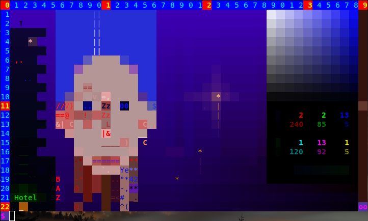

  
**H**ighly unportable b**A**sh s**C**ript for drawing in terminal O**K**?
## Instollation
Just type *make*, this will compile the programs needed by ***hack.sh***. One importante thing is that
*git* for **Windows** has automatic settings that add *carriage return* to every new line, if you try to
run the script from *Cygwin* for example, in that case either change git settings or download instead of
cloning the repository.  

## Compatibility
:) joking, it's possible to rewrite all the stuff using C libraries, but the main reason for writing this
stuff was to learn bash scripting and to have fun. Coz I can't give you guarantee that this is a bug free
program that will run on \_e v e r y\_ terminal and bash version (actually I can probably guarantee you
the opposite) was thinking to make a video showing what the program can do, but all those social things
sucks and give it up. You can try it on MATE and Gnome Terminals plus Cygwin for Windows it also should 
run on Konsole and xterm, but there are some issues with _mouse tracking_ and colours I couldn't figure
out.
## hack.sh
The name is misleading, it obviously has nothing to do with hacking, but all those 
**XTerm Control Sequences** were refered by one site, in the beginning when I started the project,
as hacking or something like this, so I saved them in a file called _hack.sh_ and later decided to keep
that name coz it's cool:). There are three modes of operation:
1. Command Mode
2. Playing Mode
3. Drawing Mode

The program starts in _Command Mode_ and the prompt awaits for your commands:). You can switch to modes
2 and 3 by pressing F2 and F3 respectively. In mode 2 press F4 to switch to mode 1 (F1 triggers the Help
on some terminals), and from mode 3 you can switch to mode 1 by clicking the blinking `oo` at the lower
right corner. Now we are going to explain each mode by turn in detail:).
## Command Mode
Command Line has a very simple functionality, one can use Left and Right arrow keys to move back
and forth, Backspace for deleting characters, Up and Down keys for Command History and Enter to execute
commands. All righty so it will evaluate anything typed and redirect the error to _hack.log_. Zo don't
use `echo` or `ls` or something like this coz it will screw up the canvas:). Instead use `zebug` function
to view some internal values, for example before starting _hack.sh_ open another terminal and type
`tail -f hack.log` than from _Command Mode_ type `zebug ${BgrClr}` this will give the current value of
background colour. _Command Mode_ is the working horse mode of _hack.sh_, you can draw anything just by
typing commands. There are no public and private methods here but to be used properly some of the commands
should be invoced by their wrapper (not rapper, thanks God) functions or their shortcuts. For example
to draw a pixel, one has to specify 4 things background and foreground colours, text and SGR, the last
one is a parameter that will make the text bold or blinking etc. It is possible to set up _BgrClr_
directly by typing `BgrClr="r;g;b"`, where _r_, _g_, and _b_ range from _0_ to _255_, but that
won't update the Colour Tab. Similary coz of the undo functionality one has to use the shortcut `d` rather
then `Draw`. Zo now we are going to dance, I'll make a move and you'll repeat after me are you ready?
Let's go!
1. Start _hack.sh_, now type
2. `sb 0 100 60` - This will set bgr with hue, saturation and value
3. `sf 260 90 30` - Sef fgr
4. `t 'wt'` - Set text
5. `d 1 1` - draw pixel at position x=1, y=1
6. `x` - switch colours
7. `t 'f?'` - Set text
8. `sgr ${Blnk}` - blinking text
9. `d 2 1` - draw pixel

Now this depends on the size of your terminal but on the upper right corner you see a Hue Tab, you can
get this colours by `GetBgr` function with arguments specifying positions of the colour. Let's assume
the x-coor of the rightmost colours is xR than type the following:

10. `gb xR 1`
11. `Hue 12` - degree in range [0, 360)
12. `x`
13. `gb (xR - 4) 1`
14. `x`
15. `t '  '`
16. `b 12 12 21 21 Draw` - draw a box
17. `t "'."`
18. `sgr ${Norm}`
19. `gr 14 14 19 19 v`
20. `t '__'`
21. `gr 22 11 33 22`
22. `b 24 13 31 20 Eraser`
23. `Undo`
24. `b 23 12 32 21 Eraser`
25. `e 33 12`
26. `sb 0 100 100`
27. `sf 0 0 100`
28. `t '  '`
29. `c 24 13 32 21`
30. `sb 30 100 100`
31. `t "${king}"`
32. `sgr ${Bold}`
33. `d 28 16`

Do you like it? Naah! OK type F2 to enter _Playing Mode_ so you can fix it.

## Playing Mode
