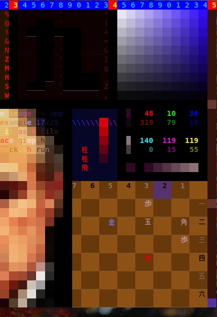
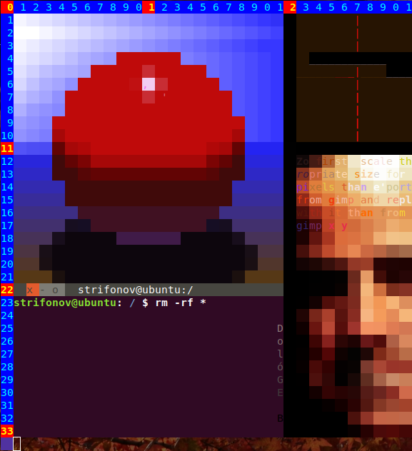

  
**H**ighly unportable b**A**sh s**C**ript for drawing in terminal O**K**?
## Instollation
Just type *make*, this will compile the programs needed by ***hack.sh***. One important thing is that
*git* for **Windows** has automatic settings that add *carriage return* to every new line, if you try to
run the script from *Cygwin* for example, in that case either change git settings or download instead of
cloning the repository.  

## Compatibility
:) joking, it's possible to rewrite all the stuff using C libraries, but the main reason for writing this
stuff was to learn bash scripting and to have fun. Coz I can't give you guarantee that this is a bug free
program that will run on \_e v e r y\_ terminal and bash version (actually I can probably guarantee you
the opposite) was thinking to make a video showing what the program can do, but all those social things
sucks and give it up. You can try it on MATE and Gnome Terminals plus Cygwin for Windows it also should 
run on Konsole and xterm, but there are some issues with _mouse tracking_ and colours I couldn't figure
out.
## hack.sh
The name is misleading, it obviously has nothing to do with hacking, but all those 
**XTerm Control Sequences** were referred by one site, in the beginning when I started the project,
as hacking or something like this, so I saved them in a file called _hack.sh_ and later decided to keep
that name coz it's cool:). There are three modes of operation:
1. Command Mode
2. Playing Mode
3. Drawing Mode

The program starts in _Command Mode_ and the prompt awaits for your commands:). You can switch to modes
2 and 3 by pressing F2 and F3 respectively. In mode 2 press F4 to switch to mode 1 (F1 triggers the Help
on some terminals), and from mode 3 you can switch to mode 1 by clicking the blinking `oo` at the lower
right corner. Now we are going to explain each mode by turn in detail:).
## Command Mode
_Command Line_ has a very simple functionality, one can use Left and Right arrow keys to move back
and forth, Backspace for deleting characters, Up and Down keys for _Command History_ and Enter to execute
commands. All righty so the _Command Line_ will evaluate anything typed and redirect the error to
 _hack.log_. Zo don't use `echo` or `ls` or something like this coz it will screw up the canvas:).
Instead use `zebug` function to view some internal values, for example before starting _hack.sh_ open
another terminal and type `tail -f hack.log` than from _Command Mode_ type `zebug ${BgrClr}` this will
give the current value of background colour. _Command Mode_ is the working horse mode of _hack.sh_,
you can draw anything just by typing commands. There are no public and private methods here but to be
used properly some of the commands should be invoked by their wrapper (not rapper, thanks God) functions
or their shortcuts. For example to draw a pixel, one has to specify 4 things background and foreground
colours, text and SGR, the last one is a parameter that will make the text bold or blinking etc.
It is possible to set up _BgrClr_ directly by typing `BgrClr="r;g;b"`, where _r_, _g_, and _b_ range
from _0_ to _255_, but that won't update the Colour Tab. Similarly coz of the undo functionality one
has to use the shortcut `d` rather then `Draw`. Zo now we are going to dance, I'll make a move and you'll
repeat after me are you ready? Let's go!
1. Start _hack.sh_, now type
2. `sb 0 100 60` - This will set bgr with hue, saturation and value
3. `sf 260 90 30` - Sef fgr
4. `t 'wt'` - Set text
5. `d 1 1` - draw pixel at position x=1, y=1
6. `x` - switch colours
7. `t 'f?'` - Set text
8. `sgr ${Blnk}` - blinking text
9. `d 2 1` - draw pixel

Now this depends on the size of your terminal but on the upper right corner you see a Hue Tab, you can
get this colours by `GetBgr` function with arguments specifying positions of the colour. Let's assume
the x-coor of the rightmost colours is xR than type the following:

10. `gb xR 1`
11. `Hue 12` - degree in range [0, 360)
12. `x`
13. `gb (xR - 4) 1`
14. `x`
15. `t '  '` - 2 spaces
16. `b 12 12 21 21 Draw` - draw a box

It's probably wiser to save the picture now in case you mess up something, so type `Save` and the
picture will be saved at the default file _hack.pix_, than type `Load` to load or revert it.

17. `t "'."`
18. `sgr ${Norm}`
19. `gr 14 14 19 19 v`
20. `b 16 16 17 17 Eraser`
21. `Undo`
22. `Undo`
23. `t "${Void}"` - `'  '`
24. `x`
25. `gr 22 11 32 21`
26. `sb 0 100 100`
27. `sf 0 0 100`
28. `c 24 13 30 19`
29. `sb 30 100 100`
30. `t "${rook}"`
31. `d 25 15`
32. `e 27 16`
33. `gp 26 19` - get pixel
34. `line 26 19 26 26`

Do you like it? Naah! OK hit F2 to enter _Playing Mode_ so we can fix it.

## Playing Mode
Probably it's not a good idea to play like in **_Blade Runner;_** move left, go right, hit this etc.,
but you can use _arrow_ keys to move around and the _Space Bar_ to draw. The _Hue Tab_ was designed for
this mode. To get a color from the _Hue Tab_ press the _Tab_ key and than _g_ over some colour which will
get pixel's background data. Hitting _Tab_ again will return to the previous position. To get all pixel's
data hit _p_, but be careful not to do it over empty pixels or in the _Tab Area_ coz it will
set _Flag_ to zero (this is a bit of a technical issue, but zero flag pixels are not displayed by the
_Load_ function and _Undo_ will act like an _Eraser_, so in case that happens type `Flag=1`). Also _u_
will _Undo_ and _x_ will _Switch_. Now press _F4_ and than _F3_ to enter _Drawing Mode_.

## Drawing Mode
OKAY This is even more weird coz there exist something called **Mouse tracking** (`man console_codes`).
So it's possible to get cursor coorz at button-1 pressed and released. The program than uses the _line_
function to draw a line between these points. Clicking in the _Tab_ area will pick up background color,
pressing _u_ and _x_ will _Undo_ and _Switch_ respectively.

## Functions
+ zebug **_str_**

   Used for debugging purposes, it will redirect **_str_** to _hack.log_. For example 
`zebug "$(ls -l)"` will dump _hack_ directory contents at _hack.log_.
+ Save/Load **_FileName_**

   Save/Load picture to **_FileName_** (default is _hack.pix_)

Now follows a list of shortcut or wrapper (thanks God) or both functions.

+ sb/sf (_SetBgrHSV/SetFgrHSV_) **_Hue Saturation Value_**

   Set background/foreground colour by specifying its _HSV_ coorz. Make no mistake here coz it
will fill your canvas with numbers:).

+ x (_Switch_)

   Or Svitch:), swaps foreground and background colours.

+ gp (_GetPixel_) **_x y_**

   Get all pixel attributes at **_x y_**, as noted before, don't use it over empty pixels
and in the _Tab_ area.

+ gb/gf (_GetBgr/GetFgr_) **_x y_**

   Get background and foreground pixel attributes (use _gb_ at _Hue Tab_).

+ d (_Draw_) **_x y_**

   Here we go again. Draw a pixel at **_x y_**.

+ t (_SetText_) **_Text_**

   This is actually the advantage of _hack.sh_ the possibility of making textures with text:). It is
possible to draw Unicode chars as well, but you have to name them in the script like this `evening='夕'`.
Note that these are 16-bit wide characters and will get 2 cursors, that is one pixel, zo type
`t "${evening}"`. Otherwise, with 8-bit characters, you have to set 2 characters, for example `t '_*'`.

+ gr (_Gradient_) **_x0 y0 x1 y1 [v]_**
   
   Background to foreground gradient, **_(x0, y0)_** is the upper left corner,
**_(x1, y1)_** is the
lower right corner, **_v_** is vertical direction flag.

+ e (_Eraser_) **_x y_**
   
   Erase a pixel at position **_(x, y)_**.

+ b (_Box_) **_x0 y0 x1 y1 func_**

   **_func_** is either _Draw_ or _Eraser_, and the region is the same as in _gr_. Depending on the
value of **_func_** _b_ will either draw or erase the region.
   
+ c (_Circ_) **_x0 y0 x1 y1_**

   Region is the same as in _gr_ and _b_ and the function will draw an ellipse bounded in it. The 
difference is that here coorz can be negative.

+ sgr (_SetSGR_) **...**

   Here we have *va_args*:), for example `sgr ${Bold} ${Blnk}` will display bold and blinking text
(after calling _d_). For a list of additional parameters look at the beginning of the script.

This is the end of shortcut and thanks God functions.

+ UndoBgr/UndoFgr

   Undo background/foreground colors.

+ SetBgrRGB/SetFgrRGB **_r g b_**

   Set bgr/fgr colors by _r g b_ values [0, 255]

+ Hue **_angle_**

  This will update the _Hue Tab_, **_angle_** is in the range _[0, 360)_

+ Undo

   One level undo (same as Ctrl-Z in Photoshop).

+ gimp **_x y_**

   It is possible to import an external image into the canvas at position **_(x, y)_**, but it has to be
resized and exported as a C header file in _gimp_. To view an example type `gimp 1 1`, for further
instructions type `Load pix/pmode.pix`

+ line **_xA yA xB yB_**

   Draws a line from point A to point B.
